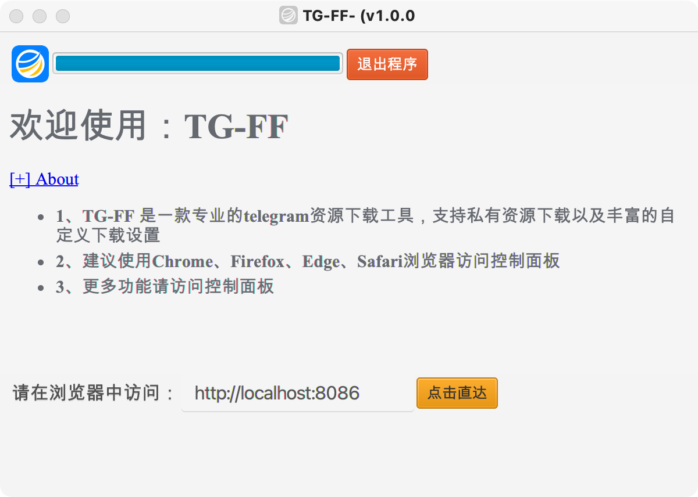
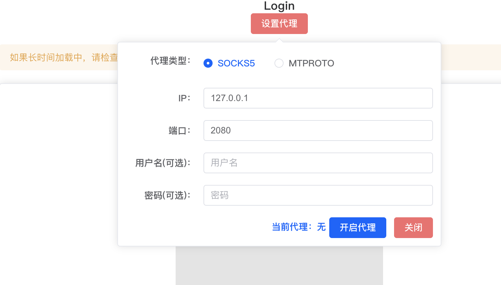
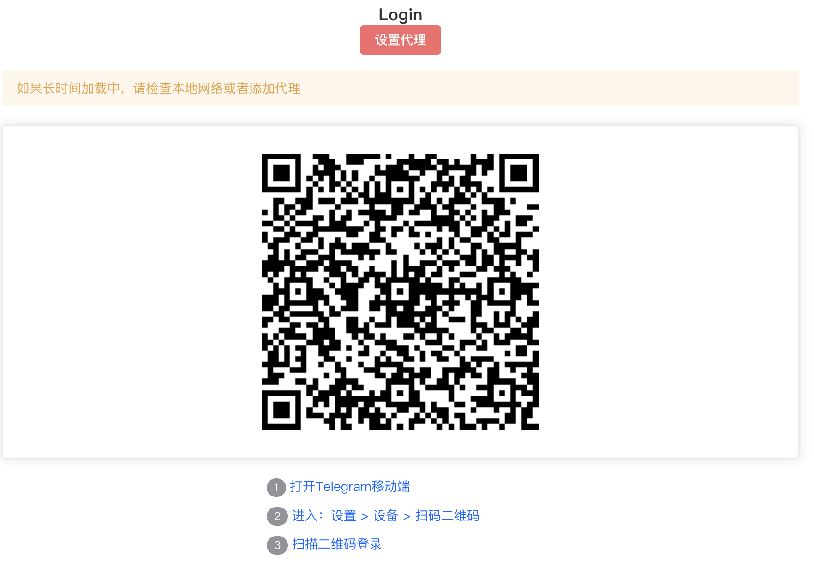

# 欢迎使用 TG-FF

TG-FF是一款专业的telegram资源下载工具，支持保护资源下载以及丰富的自定义下载设置

# 安装包下载

| 操作系统                                       |                                   下载                                    |
|:-------------------------------------------|:-----------------------------------------------------------------------:|  
| **Windows x64**                            | <a href="https://pan.quark.cn/s/e9c4db2157b9" target="_blank">下载安装包</a> |
| **Mac OS X x64**                           | <a href="https://pan.quark.cn/s/9c9db09a7078" target="_blank">下载安装包</a> |

# Linux
```
curl -sSL https://raw.githubusercontent.com/txhlxyz/tg-ff/refs/heads/main/setup.sh | bash

```
# Docker

```
docker run \
  --restart=always \
  --name tg-ff \
  --privileged=true \
  -p 8086:8086 \
  -v /etc/localtime:/etc/localtime:ro \
  -v /opt/tg-ff/downloads:/opt/tg-ff/downloads \
  -d oan1x/tg-ff:2.1.4
```

# 启动界面

* 安装完成后，启动程序进入以下界面，点击【点击直达】按钮，会起调本地浏览器，如果无法打开默认浏览器，可复制地址在浏览器中访问


# 网络代理

* 进入主界面，如果你电脑无法直接访问外网请添加代理.
> 注意：如果是用梯子，也需要设置代理，大部分梯子都默认开启了socks代理，可以在梯子软件中查看



# 扫码登录

* 如果网络没问题将会进入登录界面，使用telegram手机客户端扫码登录即可


# 常见问题
## - linux支持的系统
目前只支持：Debian、Ubuntu、Red Hat、Fedora、CentOS 8.0+、Oracle
el6和el7系列不支持，Linux建议使用docker运行


