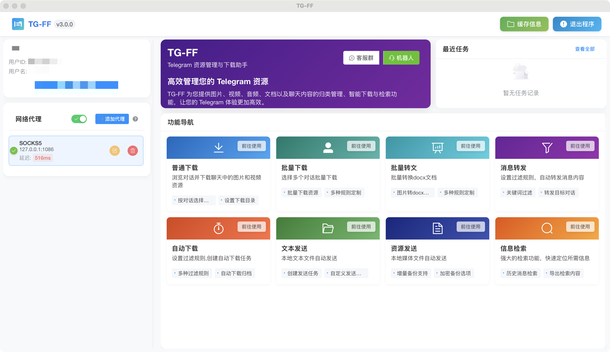

# TG-FF - 突破飞机(Telegram)媒体保存限制 | 下载灰色图标内容 | 批量保存受保护图片视频

  
  
  

    
    
    
    
    
    
  

  
  <h3>🔓 突破飞机无法保存图片视频限制 | 灰色图标下载 | 电报资源管理工具</h3>
  
  

    <a href="https://tg-ff.com" class="btn btn-primary" style="font-size: 1.2em; padding: 10px 20px; margin: 10px;">
      🌐 访问官方网站
    </a>
  

## 🌟 项目介绍

**TG-FF**是一款专为飞机(Telegram)用户设计的全能资源管理工具，可以**完美解决飞机群组设置了禁止保存而无法下载图片和视频的问题**。无论是显示灰色图标还是提示"无法保存此内容"的媒体，都能轻松批量下载，同时支持资源智能整理、自动分类和高效检索功能。

> 📢 "突破飞机保存限制，让受保护的图片和视频触手可及！"

### 为什么选择TG-FF?

- **🔓 突破限制** - 下载飞机设置了禁止保存的图片和视频，完美解决灰色图标无法下载问题
- **📦 批量下载** - 一键批量保存电报群组和频道中的所有受保护媒体内容
- **🗂️ 智能整理** - 自动分类海量媒体资源，按时间、类型、关键词等多维度组织内容
- **🔍 快速检索** - 强大的搜索功能，秒级找到任何需要的飞机资源

## 📋 核心功能

### 🔐 突破飞机保存限制
- **绕过保护** - 完美下载显示灰色图标、提示"无法保存此内容"的媒体文件
- **无视禁止转发** - 轻松保存设置了禁止转发的频道内容
- **原图下载** - 保存原始高清图片和视频，无损画质
- **适用全场景** - 支持群组、频道、私聊中的受保护媒体下载

### ⬇️ 多功能下载中心
- **选择性下载** - 精确筛选并下载需要的内容，避免无用资源占用空间
- **批量保存** - 一键下载整个群组或频道中的所有媒体文件
- **智能队列** - 优化下载任务，高效利用带宽
- **断点续传** - 支持下载中断后继续，无需重新开始
- **自定义目录** - 灵活设置下载路径，保持资源整齐

### 📤 高级转发与分享
- **批量转发** - 支持跨群组/频道批量转发消息
- **智能分流** - 根据内容类型自动分发到不同目标群组
- **定时任务** - 设置自动执行的转发和下载任务
- **格式保留** - 完整保留原消息格式和内容

### 🔍 全文检索引擎
- **实时索引** - 自动为所有消息建立索引，支持即时搜索
- **多条件搜索** - 按关键词、时间、类型、发送者等组合查询
- **上下文浏览** - 查看搜索结果的完整对话上下文
- **搜索历史** - 记录常用搜索，一键重复使用

## 💻 系统要求与兼容性

### 支持的操作系统
- **Windows** 10/11 (64位)
- **macOS** 11.0+ (包括Intel芯片和Apple Silicon M系列芯片)

### 硬件推荐配置
- 处理器: 双核2.0GHz以上
- 内存: 4GB RAM (推荐8GB以上)
- 存储空间: 至少1GB可用空间
- 网络: 稳定的互联网连接

## 🚀 快速开始

### 下载与安装

从以下官方渠道获取最新版本:

- [GitHub Releases](https://github.com/txhlxyz/tg-ff-remark/releases) - 获取最新版本
- [夸克网盘](https://pan.quark.cn/s/a05cae4643f6) - 国内用户推荐下载渠道

### 快速上手指南

1. **账号登录** - 使用飞机(Telegram)的QR码安全登录，支持代理设置
2. **选择对话** - 从左侧列表选择要下载内容的群组或频道
3. **浏览内容** - 查看所有媒体内容，包括受保护的图片和视频
4. **一键下载** - 选择需要的内容，突破限制直接下载保存

> 📝 详细的使用教程请查看[官方文档](https://tg-ff.com/guides/quickstart)

## 📱 常见使用场景

### 突破飞机群无法保存内容限制
适用于需要保存电报群组中设置了禁止保存媒体的情况，TG-FF可以轻松突破这一限制。

### 批量下载频道历史媒体
快速批量下载飞机频道中的历史图片和视频，即使显示灰色图标也能完美保存。

### 资源分类整理
自动对下载的媒体文件进行分类整理，建立个人资源库。

### 跨群转发分享
将重要内容安全地转发到其他群组或保存到个人收藏。

## 🔄 最新更新

### 版本 2.2.0 (2024-03-21)

- **✨ 新增**: Apple Silicon原生支持、高级搜索引擎、批量处理优化
- **🔧 改进**: 界面重新设计、性能提升70%、扩展代理支持
- **🐛 修复**: 解决代理连接问题、修复内存占用、优化视频处理

[查看完整更新历史](https://tg-ff.com/changelog)

## 🛠️ 常见问题解答

<b>Q: 飞机群禁止保存图片，TG-FF怎么实现下载的？</b>

A: TG-FF使用特殊技术，通过Telegram官方API的合法调用方式，巧妙地绕过了媒体保存限制。这种方法安全有效，不会影响您的账号安全，是突破飞机限制下载媒体的理想解决方案。

<b>Q: TG-FF使用安全吗？会泄露我的账号信息吗？</b>

A: TG-FF使用官方API，所有认证过程都在本地完成，不会收集或存储您的账号凭证。软件代码开源，您可以自行审查安全性。

<b>Q: 能批量下载大型群组的所有媒体文件吗？</b>

A: 可以。TG-FF针对大型群组优化了处理逻辑，支持增量索引和分批处理，可以有效处理包含数十万条消息的大型群组，并支持各种筛选条件，如时间范围、媒体类型等。

<b>Q: 为什么我的电报显示灰色图标无法保存图片？</b>

A: 这是因为群组或频道管理员设置了"禁止保存媒体"选项。TG-FF专为解决这个问题设计，能够突破限制，让您正常下载这些受保护内容。

更多问题请访问我们的[常见问题页面](https://tg-ff.com/faq)。

## 👥 社区与支持

- [Telegram官方群组](https://t.me/tg_ff_group1) - 获取实时帮助和交流
- [GitHub讨论区](https://github.com/txhlxyz/tg-ff-remark/discussions) - 功能建议与bug报告
- [使用教程](https://tg-ff.com/getting-started) - 详细的使用指南

## 📝 许可证

TG-FF采用[MIT许可证](LICENSE)开源，您可以自由使用、修改和分发本软件。

## 🔮 未来规划

- **跨平台支持** - Linux系统支持和Web版本
- **AI智能分类** - 基于内容的智能分类系统
- **云同步功能** - 多设备资源管理状态同步
- **批量处理优化** - 进一步提升大规模下载效率

## ⭐ 支持项目

如果TG-FF帮助您成功下载了受保护的飞机媒体内容，请考虑:

- 给项目[点个star](https://github.com/txhlxyz/tg-ff-remark) ⭐
- [分享项目](https://twitter.com/intent/tweet?text=发现了一个神器！TG-FF可以突破飞机群设置了禁止保存的限制，轻松下载图片和视频，灰色图标也能保存！&url=https://github.com/txhlxyz/tg-ff-remark) 给更多需要的人
- [提交功能建议](https://github.com/txhlxyz/tg-ff-remark/issues/new) 或参与开发

---

  TG-FF - 突破飞机媒体保存限制的最佳工具
   
  © 2024 TG-FF Team. All rights reserved.

 